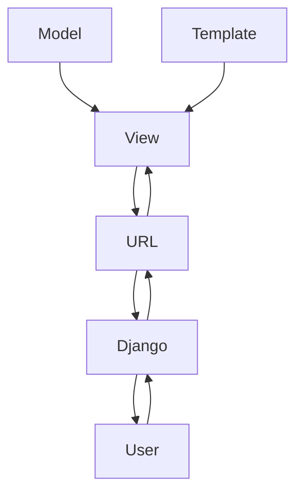

# Django

## Session 1 : create project

create a virtual environment for your project

`python -m vnev myvenv`

now your venv(virtual environment ) is created 

then you have to activate it

`myvenv/Scripts/activate.bat`

`(myvenv) C:\Users\AmirAbbas\Desktop\test>`

it should be like this

### install the Django by this command

`pip install Django`

`Django-admin startproject mypj`


then you have a manage.py that is a tool to work with your project and your project folder .

### use a texteditor (I prefer pycharm) 


Go to setting and change the interpreter and chose your venv for terminal

### folow this setps:
1 .Go to pycharm's setting


2.Select project then python interpreter


3.Select the interpreter address 

yourenv > Scripts > python.exe


4.Press ok button then apply this change 


## Lets run our project for first time 

`python manage.py runserver`

you have something like error that is about migration

`python manage.py migrate`

Django will create a database by default sqllight

you can check the database information in setting.py 

## MVT


## creating a user for access Django admin panel

`python manage.py createsuperuser`

then enter username and password for user 

## creatin App 

`python manage.py startapp myapp`

create urls.py file in your new app 

then you have to know Django about your new app

go to setting.py and add the new app name in INSTALLED_APPS list


```python
INSTALLED_APPS = [
    "django.contrib.admin",
    "django.contrib.auth",
    "django.contrib.contenttypes",
    "django.contrib.sessions",
    "django.contrib.messages",
    "django.contrib.staticfiles",
    "Home",
    'new1',
]
```
like this

create a url for your app
### urls.py
```python
from django.urls import path
from . import views

urlpatterns = [
    path("new/", views.mew),
]
```
### views.py
```python
from django.shortcuts import render
def mew(request):
    pass
```

all views functions have to give request 

lets make view.py better 
```python
from django.shortcuts import render
from django.http import HttpResponse

def mew():
    return HttpResponse("mew user")

```
## Add app's Url to project
### mypj > urls.py 
check that include imported 
```python
from django.contrib import admin
from django.urls import path, include
```
```python 
urlpatterns = [
    path("admin/", admin.site.urls),
    path("", include("Home.urls")),
    #add this path and use include
    path("new/", include("new1.urls"))

]
```
## Templates

#### Create a folder and name it Templates
then you have to add it to your project 

go to setting.py 
```python
TEMPLATES = [
    {
        "BACKEND": "django.template.backends.django.DjangoTemplates",
        "DIRS": [],
        "APP_DIRS": True,
        "OPTIONS": {
            "context_processors": [
                "django.template.context_processors.debug",
                "django.template.context_processors.request",
                "django.contrib.auth.context_processors.auth",
                "django.contrib.messages.context_processors.messages",
            ],
        },
    },
]
```
and add the templates in DIRS
```python
TEMPLATES = [
    {
        "BACKEND": "django.template.backends.django.DjangoTemplates",
        "DIRS": [BASE_DIR / "Templates"],
        "APP_DIRS": True,
        "OPTIONS": {
            "context_processors": [
                "django.template.context_processors.debug",
                "django.template.context_processors.request",
                "django.contrib.auth.context_processors.auth",
                "django.contrib.messages.context_processors.messages",
            ],
        },
    },
]
```

create html file to show to clients 

```python
def mew(request):
    return render(request , "mew.html")
```
