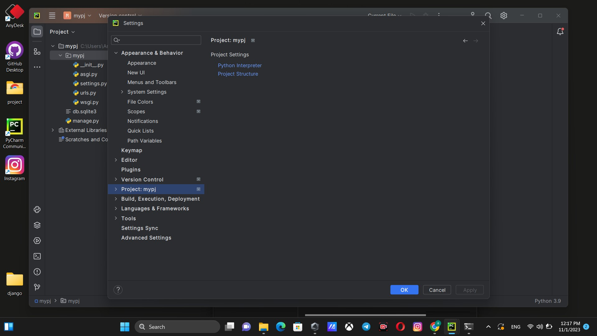
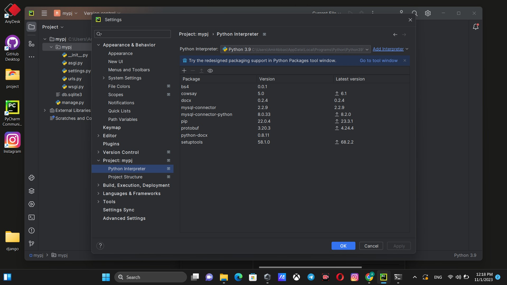
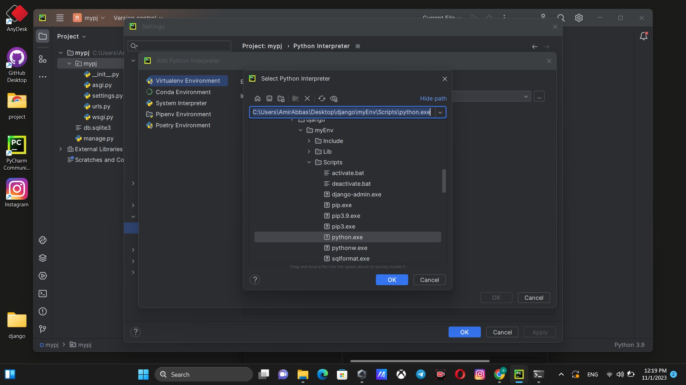
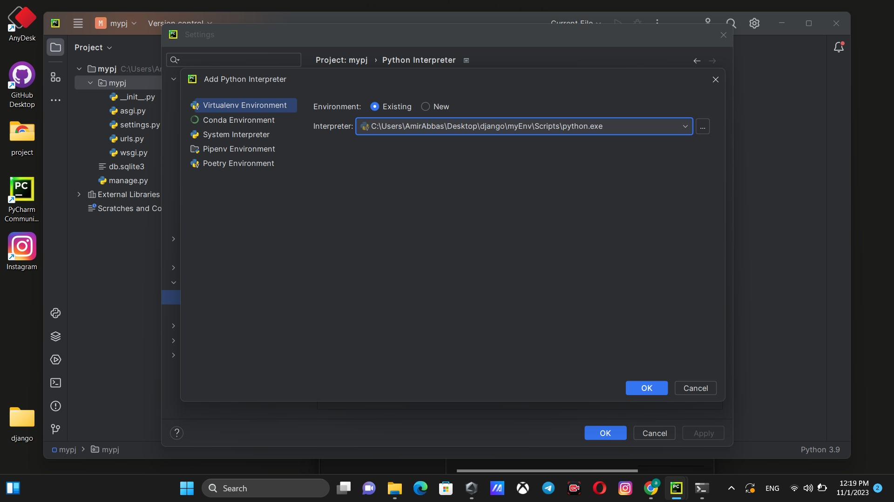
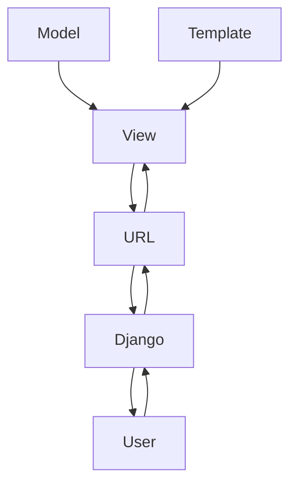
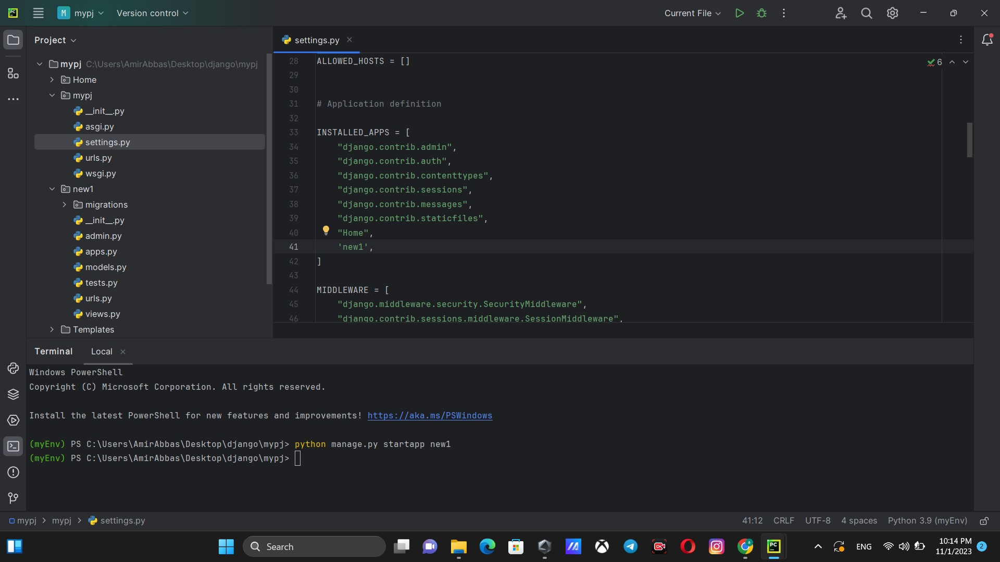
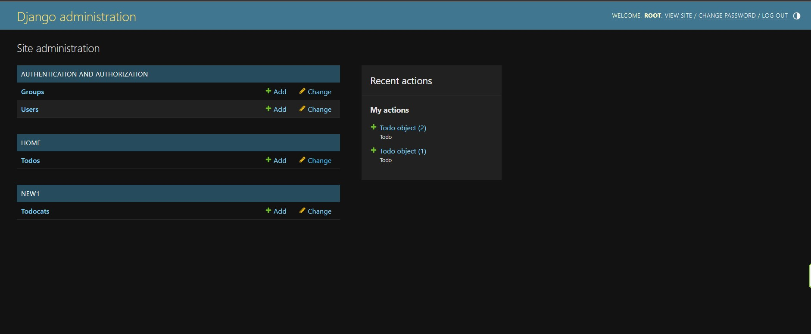

# Django

### Session 1 : create project

create a virtual environment for your project

`python -m venv myvenv`

now your venv(virtual environment ) is created 

then you have to activate it

`myvenv\Scripts\activate.bat`

`(myvenv) C:\Users\AmirAbbas\Desktop\test>`

it should be like this

### install the Django by this command

`pip install Django`

`Django-admin startproject mypj`


then you have a manage.py that is a tool to work with your project and your project folder .

### use a texteditor (I prefer pycharm) 


Go to setting and change the interpreter and chose your venv for terminal

### folow this setps:
1 .Go to pycharm's setting


2.Select project then python interpreter



3.Select the interpreter address 

yourenv > Scripts > python.exe



4.Press ok button then apply this change 



## Lets run our project for first time 

`python manage.py runserver`

you have something like error that is about migration

`python manage.py migrate`

Django will create a database by default sqllight

you can check the database information in setting.py 

## MVT


## creating a user for access Django admin panel

`python manage.py createsuperuser`

then enter username and password for user 

## creatin App 

`python manage.py startapp myapp`

create urls.py file in your new app 

then you have to know Django about your new app

go to setting.py and add the new app name in INSTALLED_APPS list



```python
INSTALLED_APPS = [
    "django.contrib.admin",
    "django.contrib.auth",
    "django.contrib.contenttypes",
    "django.contrib.sessions",
    "django.contrib.messages",
    "django.contrib.staticfiles",
    "Home",
    'new1',
]
```
like this

create a url for your app
### urls.py
```python
from django.urls import path
from . import views

urlpatterns = [
    path("new/", views.mew),
]
```
### views.py
```python
from django.shortcuts import render
def mew(request):
    pass
```

all views functions have to give request 

lets make view.py better 
```python
from django.shortcuts import render
from django.http import HttpResponse

def mew():
    return HttpResponse("mew user")

```
## Add app's Url to project
### mypj > urls.py 
check that include imported 
```python
from django.contrib import admin
from django.urls import path, include
```
```python 
urlpatterns = [
    path("admin/", admin.site.urls),
    path("", include("Home.urls")),
    #add this path and use include
    path("new/", include("new1.urls"))

]
```
## Templates

#### Create a folder and name it Templates
then you have to add it to your project 

go to setting.py 
```python
TEMPLATES = [
    {
        "BACKEND": "django.template.backends.django.DjangoTemplates",
        "DIRS": [],
        "APP_DIRS": True,
        "OPTIONS": {
            "context_processors": [
                "django.template.context_processors.debug",
                "django.template.context_processors.request",
                "django.contrib.auth.context_processors.auth",
                "django.contrib.messages.context_processors.messages",
            ],
        },
    },
]
```
and add the templates in DIRS
```python
TEMPLATES = [
    {
        "BACKEND": "django.template.backends.django.DjangoTemplates",
        "DIRS": [BASE_DIR / "Templates"],
        "APP_DIRS": True,
        "OPTIONS": {
            "context_processors": [
                "django.template.context_processors.debug",
                "django.template.context_processors.request",
                "django.contrib.auth.context_processors.auth",
                "django.contrib.messages.context_processors.messages",
            ],
        },
    },
]
```

create html file to show to clients 

```python
def mew(request):
    return render(request , "mew.html")
```
## variable in template 

you can show variable in html file in {{ variable }}
like this .

you can send information from views to template with
context 
```python
def cat(request):
    Catinfo = {"name": "my-cat", "sound": "mew-mew"}
    return render(request, "cat.html", context=Catinfo)
```
```html
<!DOCTYPE html>
<html lang="en">
<head>
    <meta charset="UTF-8">
    <title>cat</title>
</head>
<body>
    <h1>{{name}}</h1>
    <h1>{{sound}}</h1>
</body>
</html>
```

## Operators in template

you can write python operator code like if else for and ...
with  that's called tags in Django

```html
    
        <h1> hello little cat pus pus</h1>
    
```
## Filter in template
```html
    <h1>{{name|upper}}</h1>
    <h1>{{sound|title}}</h1>
```
## comment in template

    {# This is a comment #}
it should not be appear in website page

## Models

after create a app Django automatically generate a models.py
in app directory 

models is for Databases and it save some information about users 
and ...

create a class with camelcase name and enter fields that you need
for database

class should inherit models.model 

``` python
from django.db import models

class Todo(models.Model):
    title = models.CharField(max_length=100)
    body = models.TextField()
    deadline = models.DateTimeField()
```
[Field types Django](https://docs.djangoproject.com/en/4.2/ref/models/fields/#field-types)
< -- all field types in Django documentation

you have to convert this to sqllight whit this command

`python manage.py makemigrations`

this fields will come to migrations folder 
and if you want to change something its ok
change it and then enter this command again 


`python manage.py migrate`for convert field to database


## Add models to admin panel

go to admin.py and write this code
```python
from .models import Todocat
admin.site.register(Todocat)
```
go to admin panel and you have Todocat informations



you have your app name then Todocat

## Add models to views 

you can show models in view by managers in django

### view.py
```python
from .models import Todocat

def mew(request):
    AllInfo = Todocat.objects.all()
    return render(request, "mew.html", {"All": AllInfo})
```
### mew.html
```html
    
        <h3>{{ i.title }}</h3>
    
```
## Extend-template

We want to reduce repetitious code in our project

So i create a base.html file to write html and body and link tag there

and I'll never write this tags again 

### base.html
```html
<!DOCTYPE html>
<html lang="en">
<head>
    <meta charset="UTF-8">
    <title>Document</title>
</head>
<body class="container">



</body>
</html>
```
### mew.html
```html


    
        <h3>{{ i.title }}</h3>
    

```

you can use block every times you want 
for example for title of each page 
create a block in title in base.html
#### base.html
```html
 <title></title>
```
and for each page use another title
#### cat.html
```html
 cat 
```
## include tag

it include the file in exact place

``

# Detail page

in my home page , I have all title of todos 

Create a url in urls.py for details page

```python
urlpatterns = [
    path("", views.home),
    path("Hello/", views.sey_hello),
    path("detail/<int:todo_id>", views.detail),
]
```
third path is for my detail page it get this url and show information of 
todo with this id 

```python
def detail(request, todo_id):
    todo = Todo.objects.get(id=todo_id)
    return render(request, 'detail.html', {"todo": todo})
```
```html

 details 


    <h3>{{todo.title}}</h3>
    <small>{{todo.created}}</small>
    <p>{{todo.body}}</p>

```

## Url names

```python
urlpatterns = [
    path("", views.home),
    path("Hello/", views.sey_hello),
    path("detail/<int:todo_id>", views.detail, name='detail'),
]
```
```html


Home

    <h1>this is Home page</h1>
    
        <a href="">{{todo.title}}</a>
        <hr>
    

```

and another 

```html
<nav class="navbar navbar-expand-lg bg-body-tertiary mb-20" >
  <div class="container-fluid">
    <a class="navbar-brand" href="">Navbar</a>
  </div>
</nav>
```
```python
urlpatterns = [
    path("", views.home , name='home'),
    path("Hello/", views.sey_hello),
    path("detail/<int:todo_id>", views.detail, name='detail'),
]
```

## Delete object 
```html

 details 


    <h3>{{ todo.title }}</h3>
    <small>{{ todo.created }}</small>
    <p>{{ todo.body }}</p>
    <a href="" class="btn btn-danger">Delete</a>

```
this is my details page 
and I add a delete button 
when you click it it go to a url that we declare in urls.py
```python
urlpatterns = [
    path("", views.home, name='home'),
    path("detail/<int:todo_id>", views.detail, name='detail'),
    path("delete/<int:todo_id>", views.delete, name='delete'),
]
```
```python
def delete(request, todo_id):
    Todo.objects.get(id=todo_id).delete()
    return redirect('home')
```

## message (flash message | one time message)

| Constant  |  Purpose |
|---|---|
| DEBUG  | Development-related messages that will be ignored (or removed) in a production deployment  |
|  INFO | Informational messages for the user  |
| SUCCESS  |  An action was successful, e.g. “Your profile was updated successfully” |
|  WARNING | A failure did not occur but may be imminent  |
| ERROR  |  An action was not successful or some other failure occurred |

in last example we deleted our todo project object with a delete button 
now I want to show a message to client that object deleted successfully 
```python
from django.contrib import messages
```
```python
def delete(request, todo_id):
    Todo.objects.get(id=todo_id).delete()
    messages.success(request, 'you deleted successfully')
    # django has messages to show client your message and it has 5 level 
    # that we said
    return redirect('home')
```
### messages.html
```html

    
    <p class="alert alert-{{ msg.tags }}">{{ msg }}</p>
    

```
then included to base.html
```html

```

## Forms

we have two method to get our information 
1. GET method : send datas from url 
2. POST method : send datas from http request

### hint : if datas are important you should send it by post method 

first , create forms.py in your app
```python
from django import forms
class TodoCreateForms(forms.Form):
    title = forms.CharField()
    body = forms.CharField()
    created = forms.DateTimeField()
```
then add this path to urls.py
```python
path("create/", views.create, name='create')
```
```python
from .forms import TodoCreateForms
def create(request):
    form = TodoCreateForms
    return render(request, 'CreateForm.html' , {"form":form})
```
to show this form 
```html


    <h3>Create Form</h3>
    <form>
    {{form}}
    <input type="submit" value="Create">
    </form>

```

Django by default give each field of form required property 
```python
class TodoCreateForms(forms.Form):
    title = forms.CharField(required=False)
    body = forms.CharField()
    created = forms.DateTimeField()
```
that you can change this .
```python
title = forms.CharField(label='onvan')
```
you can change label like this .

you should give form tag method property if you don't do this 
it would be get by default 

## let's make a real form
```html



    <h3>Create Form</h3>
    <form method="post" action="" novalidate>
        
        {{form.as_p}}
    <input type="submit" value="Create">
    </form>

```
#### view.py
```python
from .models import Todo
from django.contrib import messages
from .forms import TodoCreateForms

def create(request):
    if request.method == 'POST':
        form = TodoCreateForms(request.POST)
        if form.is_valid():
            cd = form.cleaned_data
            Todo.objects.create(title=cd['title'], body=cd['body'], created=cd['created'])
            messages.success(request,"Todo created successfully ",'success')
            return redirect('home')

    else:
        form = TodoCreateForms
    return render(request, 'CreateForm.html', {"form": form})
```

## Update Todos

```html

 details 


    <h3>{{ todo.title }}</h3>
    <small>{{ todo.created }}</small>
    <p>{{ todo.body }}</p>
    <a href="" class="btn btn-danger">Delete</a>
    <a href="" class="btn btn-info">Update</a>

```
first , I added a update button to details.html
#### urls.py
```python
    path("update/<int:todo_id>", views.update, name='update'),
```
for change something in models you have to import your model in 
forms.py in your app then
#### forms.py
```python
from django import forms
from .models import Todo

class TodoCreateForms(forms.Form):
    title = forms.CharField()
    body = forms.CharField()
    created = forms.DateTimeField()

class TodoUpdateForm(forms.ModelForm):
    class Meta:
        model = Todo
        fields = ('title', 'body', 'created')
```
or you can do this for fields
```python
        fields = ("__all__")
```
#### Update.html
```html

Update Form

    <form action="" method="post">
        
        {{form.as_p}}
        <input type="submit" value="Create">
    </form>

```
those actions was just for show to client 
```python
def update(request, todo_id):
    todo = Todo.objects.get(id=todo_id)
    if request.method == "POST":
        form = TodoUpdateForm(request.POST, instance=todo)
        if form.is_valid():
            form.save()
            messages.success(request, "your todo updated successfully ", "success")
            return redirect("detail", todo_id)
    else:
        form = TodoUpdateForm(instance=todo)
        return render(request, 'Update.html', {'form': form})
```
### hint : modelform in django has a lot more options you can learn more in django documents 

# User

create a new app "accounts"

#### accounts app > forms.py
```python
from django import forms
class UserRegisterForm(forms.Form):
    username = forms.CharField()
    email = forms.EmailField()
    password = forms.CharField()
```
#### accounts app > views.py
```python
from django.shortcuts import render, redirect
from .forms import UserRegisterForm
from django.contrib.auth.models import User
from django.contrib import messages

def user_register(request):
    if request.method == 'POST':
        form = UserRegisterForm(request.POST)
        if form.is_valid():
            cd = form.cleaned_data
            User.objects.create_user(cd['username'], cd['email'], cd['password'])
            messages.success(request, 'User registered successfully ', 'success')
            return redirect("home")
    else:
        form = UserRegisterForm
    return render(request, 'register.html', {'form': form})
```
#### register.html
```html

 Register 

    <form action="" method="post" novalidate>
        
        {{ form.as_p }}
        <input type="submit" value="Register" >
    </form>

```
### add firstname and lastname to form
#### forms.py
```python
from django import forms

class UserRegistrationForm(forms.Form):
	username = forms.CharField()
	email = forms.EmailField()
	password = forms.CharField()
	first_name = forms.CharField()
	last_name = forms.CharField()
```
#### views.py
```python
def user_register(request):
	if request.method == 'POST':
		form = UserRegistrationForm(request.POST)
		if form.is_valid():
			cd = form.cleaned_data
			user = User.objects.create_user(cd['username'], cd['email'], cd['password'])
			user.first_name = cd['first_name']
			user.last_name = cd['last_name']
			user.save()
			messages.success(request, 'user registered successfully', 'success')
			return redirect('home')
	else:
		form = UserRegistrationForm()
	return render(request, 'register.html', {'form':form})
```

## Log in
how to user log in
#### forms.py
```python
class UserLoginForm(forms.Form):
    username = forms.CharField()
    password = forms.CharField()
```
#### views.py
```python
def user_login(request):
    if request.method == "POST":
        form = UserLoginForm(request.POST)
        if form.is_valid():
            cd = form.cleaned_data
            user = authenticate(request, username=cd['username'], password=cd['password'])
            if user is not None:
                login(request, user)
                messages.success(request, 'logged in successfully', 'success')
                return redirect('home')
            else:
                messages.error(request, 'username or password is wrong', 'danger')
    else:
        form = UserLoginForm()
    return render(request, 'login.html', {'form': form})
```
```html

 Login 

    <form action="" method="post" novalidate>
        
        {{ form.as_p }}
        <input type="submit" value="Login" >
    </form>

```

## Log out
#### urls.py
```python
    path('logout/', views.user_logout, name='logout')
```
#### views.py
```python
from django.contrib.auth import authenticate, login, logout

def user_logout(request):
    logout(request)
    messages.success(request, "user loged out successfully ", 'success')
    return redirect('home')
```
## requests

### you just have access to requests in views.py and templatse
#### home.html
```html

        <h3>{{request.user.username}}</h3>
    
        <h3 class="bg-info">Log in kon dige</h3>
    
```
#### nav.html
```html

        <a href="">Log out</a>
    
        <a href="">register</a>
        <a href="">Login</a>
    
```


