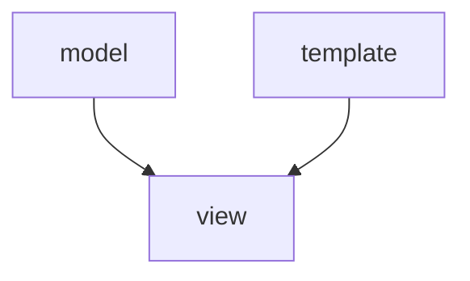

hello everybody

``` python 
for i in range(5):
    print("hello world")
```

`python manage.py runserver`

``Use `code` in your Markdown file.``

`color a `

`dir\s `



.png "optional-title")


[سایت خوب مونگارد](mongard.ir "optional-title")


# This is a chapter

# This is a chapter

Link to [this chapter](#this-is-a-chapter)


# This is a chapter
## This is siska
### Another siska
#### Another siska bladddddddd

Link to [a chapter in another file](another-file.md#some-chapter)


<!-- TOC -->
* [Main title](#main-title)
    * [Subtitle](#subtitle)
    * [Another subtitle](#another-subtitle)
* [Another main title](#another-main-title)
    * [Secondary subtitle](#secondary-subtitle)
        * [Third level header](#third-level-header)
<!-- TOC -->

I just love **bold text**.

I just love __bold text__.

Love**is**bold

Italicized text is the *cat's meow*.

Italicized text is the _cat's meow_.

A*cat*meow

This text is ***really important***.

1. First item
2. Second item
3. Third item
4. Fourth item


1. First item
2. Second item
3. Third item
    1. Indented item
    2. Indented item
4. Fourth item
5. 
At the command prompt, type `nano`.